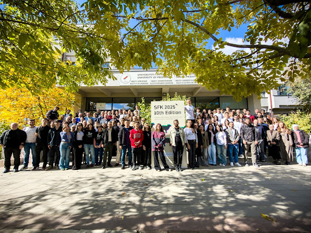

# Welcome to FLOSSK 🇽🇰

## Promoting Free Libre Open Source Software since 2009

We are a non-governmental organization based in Prishtina, Kosovo, dedicated to supporting, promoting, and developing open source software. As a collaborative community of over 40 members, we value sharing, openness, decentralization, and world improvement.

## 🚀 Flagship Projects & Platforms
**Software Freedom Kosova (SFK):** Our annual premier conference and the leading open-source event in Southeastern Europe. For over 18 years, SFK has brought together developers, activists, and researchers to promote open software and hardware.

**sensors.flossk.org:** A community-driven project focused on acquiring environmental data. We work with students and volunteers to build DIY sensor stations for measuring air quality and weather patterns across Kosovo.

**books.flossk.org:** An open platform for digitalized books, focused on preserving public domain and orphan works. We use DIY book scanners to make rare local literature and archives accessible to everyone for free.

**Prishtina Hackerspace** our physical hub for experimentation in technology, art, and science. It is more than just a lab; it’s a social center for the local tech community.

## 🛠️ How to Contribute

Whether you are a developer, a hardware geek, or just someone who loves open culture, there is a place for you here.
You don't need to be a "senior dev" to contribute to FLOSSK. We value all forms of participation:

**Software:** Create or improve projects using open-source licenses like Apache or MIT. 

**Hardware & Electronics:** Join our efforts with sensors.flossk.org or come by at Prishtina Hackerspace and use our diverse tools, including electronics, sawing and soldering facilities to bring your ideas and collaborative projects.

**Community & Events:** Help us organize workshops, bootcamps, or our flagship conference, SFK.

## 📍 Meet Us in Person
If you prefer face-to-face collaboration, join us at **Prishtina Hackerspace:**
Join our Open Meetups, every **Wednesday starting at 17:30,** we meet for casual discussions about the future of FLOSSK and local tech.

**The PUB:** We have our own bar where we host presentations and discussions. We even brew our own craft beer from time to time, providing a laid-back space to share ideas and socialize over a home-brewed pint.

**Our Community:** Our 40+ members are passionate experts across a wide range of fields, including: Software & Languages; Hardware & Electronics; AI & Machine Learning; InfoSec & Cybersecurity

## 🎨 Branding & Assets
Working on a FLOSSK-related project? Please use our official branding to keep our visual identity consistent. You can find all logos (including the Sorra symbol), the custom Alfabeti typeface, and our brand book in our branding repository:

👉 [FLOSSK Branding Assets](https://github.com/flosskosova/Flossk_branding)

## 🤝 Join the Conversation
We don't just commit code; we build connections. Connect with us through our primary digital channels to start contributing or sharing your next big idea:

💬 **Join our Hub:** Our central communication space, join the community at  Our Hub Community to get informed and formally involved in association projects
🌐 **Our Website:** Visit flossk.org for more info on our history and how we’ve been promoting FLOSS since 2009.

